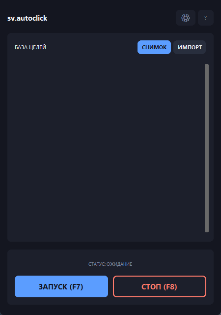
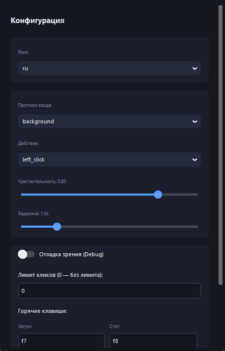

[Русский](README.md) · **English**

# sv.autoclick


An autoclicker for Windows that finds its target on screen by picture rather
than by coordinates. You take a snapshot of the element you care about — a
button, an icon, anything — and the program clicks it wherever it turns up. If
the element moves or the window is dragged elsewhere, the click still lands.



## What it does

- **Finds targets by image** — template matching through OpenCV instead of
  blind clicks at fixed coordinates.
- **Several targets at once** — a target list with switches, so any of them can
  be turned off without deleting it.
- **Snip from inside the app** — select a region of the screen and it becomes a
  target.
- **Two ways to click** — with the real cursor, or straight into a chosen
  window so your mouse stays free for other work.
- **Scan region** — restrict the search to part of the screen, which speeds
  things up noticeably.
- **Click limit** — stop after a given number of clicks.
- **Custom hotkeys** — instead of hard-wired F7 and F8, including combinations
  like `ctrl+shift+r`.
- **Statistics** — how many clicks were made and how long the engine has run.
- **Vision debug** — a window showing exactly what the program found on screen.
- **Russian and English** interface, picked from the system locale.

## What it's for

Repetitive actions with no hotkey and no scripting hook: clicking through
identical dialogs, waiting for a button to appear in an old program without an
API, running the same scenario in an app under test, automating routine work in
an interface that keeps moving its elements around.

## Responsible use

This is a tool for automating your own workflow. Don't use it where the rules
of a service forbid automated input — in online games that is almost always a
breach of the terms of service. The project is not intended or tested for that.

## Getting started

### Ready-made build

Download the exe from [Releases](../../releases/latest) and run it. Nothing to
install.

### From source

```bash
python -m venv .venv
```

```bash
.venv\Scripts\pip install -r requirements.txt
```

```bash
.venv\Scripts\python.exe main.py
```

Python 3.10 or newer, Windows only.

## How to use it

1. **SNIP** — select what the program should look for. Or **IMPORT** if you
   already have the picture as a file.
2. The target appears in the list. The switch beside it turns it off
   temporarily.
3. **RUN (F7)** starts scanning, **HALT (F8)** stops it. Both keys work while
   the window is minimised.
4. While running, the status line shows the click count and the elapsed time.

## Settings



| Setting | What it does |
|---|---|
| Input protocol | `physical` moves the real cursor, `background` sends the click straight to the window |
| Action | left, right or double click |
| Sensitivity | how closely the picture must match: higher is stricter |
| Cooldown | pause between clicks on the same target |
| Click limit | stop after N clicks, 0 means no limit |
| Hotkeys | your own start and stop keys |
| Scan region | restrict the search to part of the screen |
| Vision debug | a window showing what the algorithm sees |

Settings live in `phantom_config.json` next to the program.

## How it works

The program grabs the screen (or the configured region), converts it to
greyscale and looks for every active target with `cv2.matchTemplate` using the
`TM_CCOEFF_NORMED` metric. Every point scoring above the sensitivity threshold
counts as a match; the first one is clicked, after which the configured
cooldown must pass before that target is clicked again.

The `background` mode posts `WM_LBUTTONDOWN` and `WM_LBUTTONUP` straight to the
window under the given point via `PostMessage`. The cursor does not move, so
you can keep using the mouse.

## Limitations

- Windows only: the `background` mode is built on the Win32 API.
- Template matching is scale-sensitive. If the screen resolution or the UI
  scaling changes, the targets have to be captured again.
- Matching runs on greyscale, so targets that differ only in colour cannot be
  told apart.
- The more active targets and the wider the scan region, the lower the polling
  rate. Narrowing the scan region helps the most.

## License

MIT — see [LICENSE](LICENSE).
